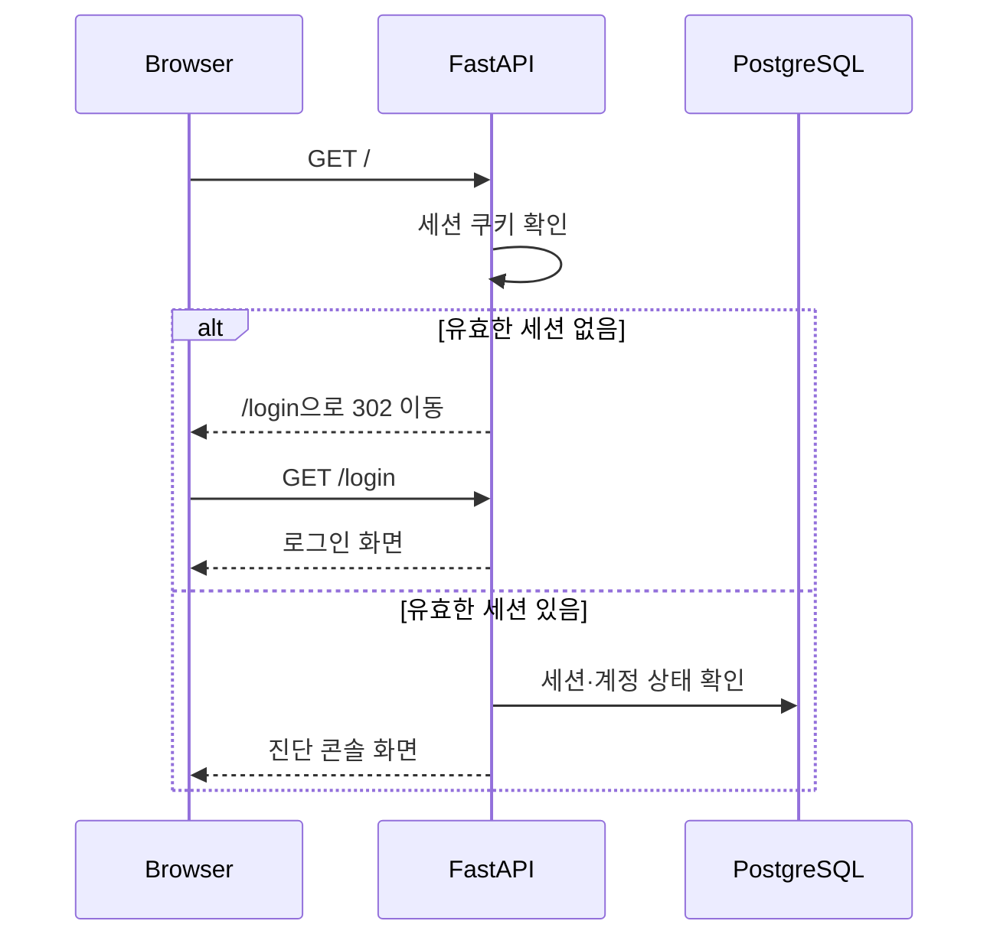
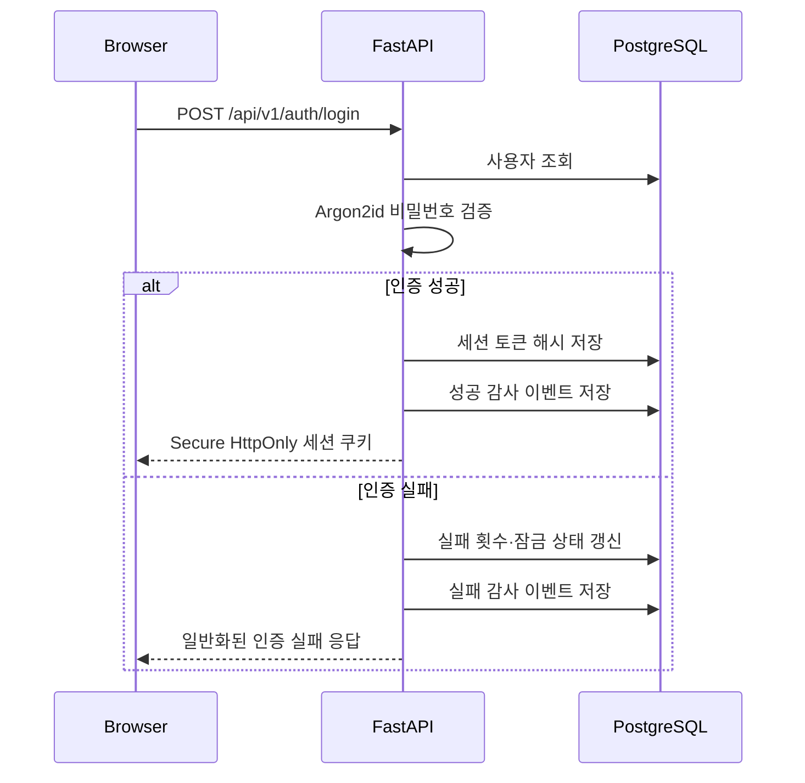
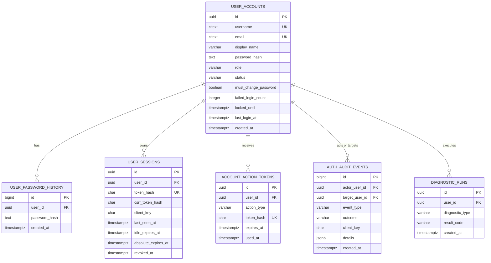

# NetProbe 로그인·계정 관리 기능 명세서

> 문서 상태: 구축 전 검토안(Draft)  
> 연계 문서: [`postgresql-database-spec.md`](postgresql-database-spec.md)  
> 대상 애플리케이션: Network Diagnostic Tool  
> 권장 인증 방식: 서버 세션 + Secure HttpOnly Cookie

## 1. 문서 목적

현재 NetProbe는 로그인 없이 누구나 웹 화면과 진단 API를 사용할 수 있다. PostgreSQL 도입과 함께 계정을 별도로 관리하고, 인증된 사용자만 진단 기능과 저장된 이력을 사용할 수 있도록 로그인·계정·권한 기능을 설계한다.

이 문서는 기능과 데이터 구조를 검토하기 위한 명세다. 이 단계에서는 로그인 화면, 인증 API, DB 테이블을 실제로 구현하지 않는다.

## 2. 목표

- 서비스 첫 접속 시 로그인 화면을 표시한다.
- 인증된 사용자만 네트워크 진단 화면과 API를 사용할 수 있게 한다.
- 계정을 PostgreSQL에서 관리한다.
- 비밀번호 원문은 저장하지 않고 안전한 단방향 해시만 저장한다.
- 사용자 역할별로 진단, 이력 조회, 계정 관리 권한을 분리한다.
- 로그인 실패, 계정 잠금, 비밀번호 변경, 세션 폐기 등 보안 이벤트를 기록한다.
- 진단 이력을 실행 사용자와 연결한다.
- 관리자가 계정을 생성·비활성화·잠금 해제·비밀번호 초기화할 수 있게 한다.

## 3. 인증 범위

### 3.1 1차 구축 범위

| 기능 | 내용 |
|---|---|
| 로그인 화면 | 아이디와 비밀번호 입력, 오류 안내 |
| 로그인·로그아웃 | 서버 세션 생성 및 폐기 |
| 현재 사용자 조회 | 로그인 상태, 표시 이름, 역할 반환 |
| 계정 관리 | 관리자에 의한 생성, 조회, 수정, 비활성화 |
| 비밀번호 관리 | 최초 변경, 본인 변경, 관리자 초기화 |
| 계정 보호 | 실패 횟수 제한, 임시 잠금, 세션 강제 종료 |
| 역할 권한 | `ADMIN`, `OPERATOR`, `VIEWER` |
| 감사 기록 | 로그인·계정·권한 관련 중요 이벤트 |
| 진단 이력 연결 | 진단 실행에 `user_id` 저장 |

### 3.2 1차 구축 제외 범위

- 공개 회원가입
- 소셜 로그인과 외부 OAuth/OIDC
- 이메일 인증 및 이메일 기반 비밀번호 찾기
- SMS 인증
- 다중 인증(MFA) 실제 구현
- 조직·팀·프로젝트 단위 권한
- API 키 발급
- SSO, LDAP, Active Directory 연동
- 사용자 프로필 이미지 업로드

MFA와 사내 SSO는 운영 공개 범위와 사용자 수가 확정된 후 2차 명세로 추가한다.

## 4. 핵심 정책

### 4.1 공개 회원가입 정책

1차 버전에서는 공개 회원가입을 제공하지 않는다.

- 최초 관리자는 서버 관리자가 CLI 명령으로 1회 생성한다.
- 이후 계정은 `ADMIN` 역할 사용자가 관리자 화면에서 생성한다.
- 기본 아이디와 기본 비밀번호를 코드 또는 마이그레이션에 포함하지 않는다.
- 새 계정은 임시 비밀번호로 생성하고 최초 로그인 후 비밀번호 변경을 강제한다.

권장 최초 관리자 생성 예시:

```powershell
python -m app.cli create-admin --username admin
```

비밀번호는 명령행 인자로 전달하지 않고 숨김 입력 프롬프트 또는 비밀관리 시스템을 사용한다. CLI 상세 형식은 구현 단계에서 확정한다.

### 4.2 사용자 식별자

- 내부 기본키는 예측하기 어려운 UUID를 사용한다.
- 로그인 아이디는 영문 소문자, 숫자, `.`, `_`, `-`만 허용한다.
- 로그인 아이디는 대소문자를 구분하지 않고 유일해야 한다.
- 표시 이름은 한글을 포함할 수 있다.
- 이메일은 1차에서 선택 항목이며 알림 기능에 사용하지 않는다.
- 이메일을 저장할 경우 소문자로 정규화하고 유일성을 적용한다.

로그인 아이디 권장 규칙:

```text
길이: 3~50자
정규식: ^[a-z0-9][a-z0-9._-]{1,48}[a-z0-9]$
```

### 4.3 비밀번호 정책

| 항목 | 권장값 |
|---|---|
| 최소 길이 | 12자 |
| 최대 길이 | 128자 |
| 해시 알고리즘 | Argon2id |
| 공백 | 앞뒤 공백도 비밀번호 일부로 처리 |
| 복잡도 강제 | 대·소문자·특수문자 조합 규칙은 강제하지 않음 |
| 차단 목록 | 유출·상용 비밀번호 목록 및 아이디 포함 비밀번호 차단 |
| 비밀번호 이력 | 최근 5개 재사용 금지 |
| 정기 변경 | 기본적으로 강제하지 않음 |
| 초기화 후 | 다음 로그인 시 변경 강제 |

무의미한 복잡도 규칙 대신 충분한 길이와 유출 비밀번호 차단을 사용한다. 보안 사고, 관리자 초기화 또는 정책 변경 시에만 변경을 강제한다.

Argon2id 권장 시작 파라미터는 운영 서버에서 1회 해싱 시간이 약 200~500ms가 되도록 벤치마크 후 결정한다.

```text
memory_cost: 64~128 MiB
time_cost: 2~4
parallelism: 1~4
salt: 라이브러리에서 사용자별 무작위 생성
```

DB에는 Argon2id 인코딩 문자열만 저장한다. 별도의 전역 pepper를 사용할 경우 `NDT_PASSWORD_PEPPER`로 비밀관리 시스템에서 제공하고 DB·Git·로그에 저장하지 않는다.

### 4.4 역할과 권한

| 기능 | `ADMIN` | `OPERATOR` | `VIEWER` |
|---|:---:|:---:|:---:|
| 로그인·로그아웃 | O | O | O |
| 본인 정보 조회 | O | O | O |
| 본인 비밀번호 변경 | O | O | O |
| HTTP·TCP·DNS 진단 실행 | O | O | X |
| 본인 진단 이력 조회 | O | O | O |
| 전체 사용자 진단 이력 조회 | O | X | X |
| 통계·대시보드 조회 | O | O | O |
| CSV 내보내기 | O | X | X |
| 계정 생성·수정·비활성화 | O | X | X |
| 역할 변경 | O | X | X |
| 사용자 세션 강제 종료 | O | X | X |
| 감사 이벤트 조회 | O | X | X |

`VIEWER`가 진단 실행 없이 본인의 이력을 조회할 수 있는지는 실제 사용자 시나리오에 따라 구축 전에 재확인한다.

### 4.5 계정 상태

| 상태 | 설명 | 로그인 |
|---|---|:---:|
| `PENDING` | 관리자가 생성했으나 최초 로그인 전 | O |
| `ACTIVE` | 정상 사용 가능 | O |
| `LOCKED` | 실패 누적으로 임시 또는 관리자 잠금 | X |
| `DISABLED` | 퇴사·권한 회수 등으로 비활성화 | X |

계정 삭제 대신 `DISABLED`와 `deleted_at`을 사용하는 소프트 삭제를 기본으로 한다. 진단 이력과 감사 기록의 행위자 연결을 보존하기 위해 운영 중 물리 삭제하지 않는다.

## 5. 로그인·로그아웃 흐름

### 5.1 최초 페이지 접속



### 5.2 로그인



로그인 성공 후 `must_change_password=true`인 사용자는 비밀번호 변경 화면으로 이동한다. 변경을 완료하기 전에는 로그아웃·비밀번호 변경·현재 사용자 조회 외 기능을 사용할 수 없다.

### 5.3 로그아웃

1. 현재 세션을 DB에서 폐기 처리한다.
2. 브라우저의 세션 쿠키를 즉시 만료시킨다.
3. 로그아웃 감사 이벤트를 기록한다.
4. 로그인 화면으로 이동한다.
5. 로그아웃 API는 이미 만료된 세션으로 호출해도 성공 응답을 반환할 수 있다.

## 6. 세션 정책

### 6.1 세션 방식

브라우저 서비스에는 서버 세션 방식을 권장한다.

- 로그인 성공 시 암호학적으로 안전한 256비트 이상의 무작위 토큰을 생성한다.
- 원본 토큰은 브라우저 쿠키에만 전달한다.
- DB에는 `SHA-256(session_token)` 해시만 저장한다.
- 요청마다 쿠키 토큰을 해시해 DB의 세션과 비교한다.
- 계정 상태가 `ACTIVE` 또는 허용된 `PENDING`인지 함께 확인한다.
- JWT를 브라우저 `localStorage`에 저장하지 않는다.

### 6.2 쿠키 설정

```text
Name: __Host-netprobe_session
HttpOnly: true
Secure: true (운영 필수)
SameSite: Lax
Path: /
Domain: 설정하지 않음
Max-Age: 절대 세션 만료시간 기준
```

로컬 HTTP 개발 환경에서는 `Secure=false`를 별도 개발 설정으로 허용할 수 있다. 운영 환경에서는 HTTPS 없이 인증 기능을 활성화하지 않는다.

### 6.3 만료 정책

| 항목 | 권장값 |
|---|---:|
| 유휴 만료 | 30분 |
| 절대 만료 | 8시간 |
| 로그인 유지 | 1차 미지원 |
| 동시 세션 | 사용자당 최대 5개 |
| 관리자 역할 세션 | 절대 만료 4시간 권장 |

매 요청마다 `last_seen_at`을 갱신하면 DB 쓰기가 과도해질 수 있으므로 마지막 갱신 후 5분 이상 지난 경우에만 갱신한다.

### 6.4 세션 폐기 조건

- 사용자가 로그아웃한 경우
- 비밀번호가 변경되거나 초기화된 경우
- 계정이 잠금·비활성화된 경우
- 관리자가 세션을 강제 종료한 경우
- 유휴 또는 절대 만료시간을 초과한 경우
- 서버가 세션 탈취를 의심한 경우

비밀번호 변경 시 현재 세션을 제외한 모든 세션을 폐기하고, 관리자 초기화·계정 비활성화 시에는 모든 세션을 폐기한다.

## 7. 로그인 실패와 계정 잠금

권장 기본 정책:

- 계정 기준 5회 연속 실패 시 15분 잠금
- IP HMAC 기준 10회/10분 초과 시 추가 지연 또는 429 응답
- 성공 로그인 시 계정의 연속 실패 횟수 초기화
- 존재하지 않는 계정에도 비밀번호 해시 검증과 유사한 시간을 사용해 사용자 열거 방지
- 오류 응답은 아이디 존재 여부나 잠금 상세를 공개하지 않음

사용자 메시지:

```text
아이디 또는 비밀번호를 확인해 주세요. 반복 실패 시 잠시 로그인이 제한될 수 있습니다.
```

관리자 감사 화면에는 실제 실패 원인(`UNKNOWN_USER`, `BAD_PASSWORD`, `LOCKED`, `DISABLED`)을 구분해 저장할 수 있지만 사용자 응답에는 노출하지 않는다.

계정 잠금만으로 분산 공격을 막을 수 없으므로 로그인 엔드포인트는 별도의 Redis 기반 rate limit 도입을 권장한다. PostgreSQL에 로그인 시도마다 동기 쓰기를 수행해 rate limit을 구현하지 않는다.

## 8. CSRF·CORS·브라우저 보안

서버 세션 쿠키를 사용하는 상태 변경 API에는 CSRF 보호를 적용한다.

- 로그인 후 CSRF 토큰을 별도 쿠키 또는 페이지 메타데이터로 발급한다.
- 상태 변경 요청은 `X-CSRF-Token` 헤더와 서버 세션의 토큰 해시를 비교한다.
- `Origin` 또는 `Referer`가 허용된 서비스 Origin인지 검증한다.
- `GET`, `HEAD`, `OPTIONS`에는 상태 변경을 구현하지 않는다.
- CORS는 필요한 Origin만 명시하고 자격 증명 허용 시 와일드카드를 사용하지 않는다.

권장 응답 헤더:

```text
Content-Security-Policy: default-src 'self'; script-src 'self'; style-src 'self' https://fonts.googleapis.com; font-src 'self' https://fonts.gstatic.com; connect-src 'self'; frame-ancestors 'none'; base-uri 'self'; form-action 'self'
X-Content-Type-Options: nosniff
Referrer-Policy: strict-origin-when-cross-origin
Permissions-Policy: camera=(), microphone=(), geolocation=()
```

운영 HTTPS 환경에서는 HSTS도 활성화한다.

## 9. 논리 데이터 모델



## 10. 인증 테이블 명세

### 10.1 `user_accounts`

| 컬럼 | 형식 | NULL | 기본값 | 설명 |
|---|---|---:|---|---|
| `id` | `uuid` | N | 애플리케이션 생성 | 사용자 PK |
| `username` | `citext` | N | - | 로그인 아이디, 대소문자 무시 유일 |
| `email` | `citext` | Y | `NULL` | 선택 이메일, 유일 |
| `display_name` | `varchar(100)` | N | - | 화면 표시 이름 |
| `password_hash` | `text` | N | - | Argon2id 인코딩 문자열 |
| `role` | `varchar(20)` | N | `'OPERATOR'` | `ADMIN`, `OPERATOR`, `VIEWER` |
| `status` | `varchar(20)` | N | `'PENDING'` | 계정 상태 |
| `must_change_password` | `boolean` | N | `true` | 최초 로그인 후 변경 강제 |
| `failed_login_count` | `integer` | N | `0` | 연속 실패 횟수 |
| `locked_until` | `timestamptz` | Y | `NULL` | 임시 잠금 해제 시각 |
| `last_login_at` | `timestamptz` | Y | `NULL` | 마지막 성공 로그인 |
| `password_changed_at` | `timestamptz` | N | `now()` | 마지막 비밀번호 변경 |
| `created_by` | `uuid` | Y | `NULL` | 생성 관리자, 최초 계정은 NULL |
| `created_at` | `timestamptz` | N | `now()` | 생성 시각 |
| `updated_at` | `timestamptz` | N | `now()` | 수정 시각 |
| `disabled_at` | `timestamptz` | Y | `NULL` | 비활성화 시각 |
| `deleted_at` | `timestamptz` | Y | `NULL` | 소프트 삭제 시각 |
| `version` | `integer` | N | `1` | 낙관적 잠금 버전 |

`created_by`는 동일 테이블 `id`를 참조한다. 마지막 활성 `ADMIN` 계정은 비활성화하거나 역할을 낮출 수 없도록 서비스 계층과 트랜잭션에서 보호한다.

### 10.2 `user_password_history`

| 컬럼 | 형식 | NULL | 설명 |
|---|---|---:|---|
| `id` | `bigint identity` | N | PK |
| `user_id` | `uuid` | N | 사용자 FK |
| `password_hash` | `text` | N | 과거 Argon2id 해시 |
| `created_at` | `timestamptz` | N | 변경 시각 |

비밀번호 변경 시 기존 해시를 이 테이블로 이동한다. 사용자별 최신 5건만 유지하며 해시도 인증정보로 분류해 관리자 화면이나 로그에 노출하지 않는다.

### 10.3 `user_sessions`

| 컬럼 | 형식 | NULL | 설명 |
|---|---|---:|---|
| `id` | `uuid` | N | 세션 PK, 브라우저에 노출하지 않음 |
| `user_id` | `uuid` | N | 사용자 FK |
| `token_hash` | `char(64)` | N | 세션 토큰 SHA-256, 유일 |
| `csrf_token_hash` | `char(64)` | N | CSRF 토큰 SHA-256 |
| `client_key` | `char(64)` | Y | 접속 IP HMAC |
| `user_agent_summary` | `varchar(255)` | Y | 브라우저·OS 수준으로 정제한 요약 |
| `created_at` | `timestamptz` | N | 로그인 시각 |
| `last_seen_at` | `timestamptz` | N | 마지막 활동 시각 |
| `idle_expires_at` | `timestamptz` | N | 유휴 만료 시각 |
| `absolute_expires_at` | `timestamptz` | N | 절대 만료 시각 |
| `revoked_at` | `timestamptz` | Y | 폐기 시각 |
| `revoke_reason` | `varchar(50)` | Y | 폐기 사유 |

원본 세션 토큰, CSRF 토큰, 전체 User-Agent, 원본 IP는 저장하지 않는다.

### 10.4 `account_action_tokens`

최초 비밀번호 설정 또는 관리자 초기화 후 일회성 작업을 안전하게 완료하기 위한 토큰이다.

| 컬럼 | 형식 | NULL | 설명 |
|---|---|---:|---|
| `id` | `uuid` | N | PK |
| `user_id` | `uuid` | N | 사용자 FK |
| `action_type` | `varchar(30)` | N | `INITIAL_PASSWORD`, `PASSWORD_RESET` |
| `token_hash` | `char(64)` | N | 원본 토큰 SHA-256, 유일 |
| `created_at` | `timestamptz` | N | 발급 시각 |
| `expires_at` | `timestamptz` | N | 만료 시각, 권장 30분 |
| `used_at` | `timestamptz` | Y | 사용 완료 시각 |
| `created_by` | `uuid` | Y | 발급 관리자 |

이메일 전송을 1차에서 구현하지 않으면 관리자가 안전한 별도 채널로 일회성 링크를 전달한다. 운영 절차가 마련되지 않으면 이 기능 대신 관리자가 임시 비밀번호를 설정하는 단순 흐름을 사용할 수 있다.

### 10.5 `auth_audit_events`

| 컬럼 | 형식 | NULL | 설명 |
|---|---|---:|---|
| `id` | `bigint identity` | N | PK |
| `actor_user_id` | `uuid` | Y | 행위 사용자, 로그인 실패는 NULL 가능 |
| `target_user_id` | `uuid` | Y | 대상 사용자 |
| `event_type` | `varchar(50)` | N | 이벤트 유형 |
| `outcome` | `varchar(10)` | N | `SUCCESS`, `FAILURE` |
| `reason_code` | `varchar(50)` | Y | 내부 실패·변경 사유 |
| `client_key` | `char(64)` | Y | 접속 IP HMAC |
| `session_id` | `uuid` | Y | 연관 세션 ID |
| `details` | `jsonb` | N | 허용 목록 기반 정제 정보 |
| `created_at` | `timestamptz` | N | 이벤트 시각 |
| `expires_at` | `timestamptz` | N | 보존 만료 시각 |

주요 이벤트:

- `LOGIN_SUCCEEDED`
- `LOGIN_FAILED`
- `LOGOUT`
- `SESSION_REVOKED`
- `ACCOUNT_CREATED`
- `ACCOUNT_UPDATED`
- `ACCOUNT_LOCKED`
- `ACCOUNT_UNLOCKED`
- `ACCOUNT_DISABLED`
- `ROLE_CHANGED`
- `PASSWORD_CHANGED`
- `PASSWORD_RESET_BY_ADMIN`
- `ACCESS_DENIED`

감사 이벤트는 수정 API를 제공하지 않는다. 정해진 보존기간 만료 또는 승인된 개인정보 삭제 절차 외에는 삭제하지 않는다.

## 11. PostgreSQL DDL 초안

검토용 DDL이며 실제 구축 시 Alembic 마이그레이션으로 변환한다. `citext` 확장은 마이그레이션 역할로 설치한다.

```sql
CREATE EXTENSION IF NOT EXISTS citext;

CREATE TABLE user_accounts (
    id uuid PRIMARY KEY,
    username citext NOT NULL UNIQUE,
    email citext,
    display_name varchar(100) NOT NULL,
    password_hash text NOT NULL,
    role varchar(20) NOT NULL DEFAULT 'OPERATOR'
        CHECK (role IN ('ADMIN', 'OPERATOR', 'VIEWER')),
    status varchar(20) NOT NULL DEFAULT 'PENDING'
        CHECK (status IN ('PENDING', 'ACTIVE', 'LOCKED', 'DISABLED')),
    must_change_password boolean NOT NULL DEFAULT true,
    failed_login_count integer NOT NULL DEFAULT 0
        CHECK (failed_login_count >= 0),
    locked_until timestamptz,
    last_login_at timestamptz,
    password_changed_at timestamptz NOT NULL DEFAULT now(),
    created_by uuid REFERENCES user_accounts(id) ON DELETE SET NULL,
    created_at timestamptz NOT NULL DEFAULT now(),
    updated_at timestamptz NOT NULL DEFAULT now(),
    disabled_at timestamptz,
    deleted_at timestamptz,
    version integer NOT NULL DEFAULT 1 CHECK (version > 0),
    CHECK (username::text ~ '^[a-z0-9][a-z0-9._-]{1,48}[a-z0-9]$')
);

CREATE UNIQUE INDEX ux_user_accounts_email_active
    ON user_accounts (email)
    WHERE email IS NOT NULL AND deleted_at IS NULL;

CREATE INDEX ix_user_accounts_status_role
    ON user_accounts (status, role)
    WHERE deleted_at IS NULL;

CREATE TABLE user_password_history (
    id bigint GENERATED ALWAYS AS IDENTITY PRIMARY KEY,
    user_id uuid NOT NULL
        REFERENCES user_accounts(id) ON DELETE CASCADE,
    password_hash text NOT NULL,
    created_at timestamptz NOT NULL DEFAULT now()
);

CREATE INDEX ix_password_history_user_created
    ON user_password_history (user_id, created_at DESC);

CREATE TABLE user_sessions (
    id uuid PRIMARY KEY,
    user_id uuid NOT NULL
        REFERENCES user_accounts(id) ON DELETE CASCADE,
    token_hash char(64) NOT NULL UNIQUE,
    csrf_token_hash char(64) NOT NULL,
    client_key char(64),
    user_agent_summary varchar(255),
    created_at timestamptz NOT NULL DEFAULT now(),
    last_seen_at timestamptz NOT NULL DEFAULT now(),
    idle_expires_at timestamptz NOT NULL,
    absolute_expires_at timestamptz NOT NULL,
    revoked_at timestamptz,
    revoke_reason varchar(50),
    CHECK (idle_expires_at > created_at),
    CHECK (absolute_expires_at > created_at),
    CHECK (idle_expires_at <= absolute_expires_at)
);

CREATE INDEX ix_user_sessions_active_user
    ON user_sessions (user_id, absolute_expires_at)
    WHERE revoked_at IS NULL;

CREATE INDEX ix_user_sessions_expiry
    ON user_sessions (absolute_expires_at)
    WHERE revoked_at IS NULL;

CREATE TABLE account_action_tokens (
    id uuid PRIMARY KEY,
    user_id uuid NOT NULL
        REFERENCES user_accounts(id) ON DELETE CASCADE,
    action_type varchar(30) NOT NULL
        CHECK (action_type IN ('INITIAL_PASSWORD', 'PASSWORD_RESET')),
    token_hash char(64) NOT NULL UNIQUE,
    created_at timestamptz NOT NULL DEFAULT now(),
    expires_at timestamptz NOT NULL,
    used_at timestamptz,
    created_by uuid REFERENCES user_accounts(id) ON DELETE SET NULL,
    CHECK (expires_at > created_at)
);

CREATE INDEX ix_account_action_tokens_active
    ON account_action_tokens (user_id, expires_at)
    WHERE used_at IS NULL;

CREATE TABLE auth_audit_events (
    id bigint GENERATED ALWAYS AS IDENTITY PRIMARY KEY,
    actor_user_id uuid REFERENCES user_accounts(id) ON DELETE SET NULL,
    target_user_id uuid REFERENCES user_accounts(id) ON DELETE SET NULL,
    event_type varchar(50) NOT NULL,
    outcome varchar(10) NOT NULL
        CHECK (outcome IN ('SUCCESS', 'FAILURE')),
    reason_code varchar(50),
    client_key char(64),
    session_id uuid,
    details jsonb NOT NULL DEFAULT '{}'::jsonb,
    created_at timestamptz NOT NULL DEFAULT now(),
    expires_at timestamptz NOT NULL,
    CHECK (expires_at > created_at)
);

CREATE INDEX ix_auth_audit_events_created
    ON auth_audit_events (created_at DESC);

CREATE INDEX ix_auth_audit_events_actor_created
    ON auth_audit_events (actor_user_id, created_at DESC)
    WHERE actor_user_id IS NOT NULL;

CREATE INDEX ix_auth_audit_events_type_created
    ON auth_audit_events (event_type, created_at DESC);

CREATE INDEX ix_auth_audit_events_expiry
    ON auth_audit_events (expires_at);
```

### 11.1 기존 진단 DB 확장 DDL

`postgresql-database-spec.md`의 테이블을 구축할 때 다음 컬럼과 FK를 함께 추가한다.

```sql
ALTER TABLE diagnostic_runs
    ADD COLUMN user_id uuid
        REFERENCES user_accounts(id) ON DELETE SET NULL;

CREATE INDEX ix_diagnostic_runs_user_created
    ON diagnostic_runs (user_id, created_at DESC)
    WHERE user_id IS NOT NULL;

ALTER TABLE audit_events
    ADD COLUMN actor_user_id uuid
        REFERENCES user_accounts(id) ON DELETE SET NULL;
```

인증 도입 후 생성되는 진단에는 `user_id`를 필수로 기록한다. DB 마이그레이션과 기존 데이터 호환을 위해 컬럼 자체는 `NULL`을 허용한다.

## 12. 인증 API 명세

### 12.1 사용자 인증 API

| 메서드 | 경로 | 설명 |
|---|---|---|
| `POST` | `/api/v1/auth/login` | 로그인 및 세션 발급 |
| `POST` | `/api/v1/auth/logout` | 현재 세션 폐기 |
| `GET` | `/api/v1/auth/me` | 현재 사용자와 권한 조회 |
| `POST` | `/api/v1/auth/change-password` | 본인 비밀번호 변경 |
| `POST` | `/api/v1/auth/complete-initial-password` | 최초 비밀번호 설정 완료 |

로그인 API만 미인증 상태에서 호출할 수 있다. 나머지 API는 원칙적으로 인증이 필요하며, 로그아웃은 세션이 없거나 이미 만료됐더라도 안전하게 성공 처리할 수 있다.

### 12.2 관리자 API

| 메서드 | 경로 | 설명 |
|---|---|---|
| `GET` | `/api/v1/admin/users` | 사용자 목록과 필터 |
| `POST` | `/api/v1/admin/users` | 계정 생성 |
| `GET` | `/api/v1/admin/users/{user_id}` | 계정 상세 |
| `PATCH` | `/api/v1/admin/users/{user_id}` | 표시 이름·이메일·역할·상태 수정 |
| `POST` | `/api/v1/admin/users/{user_id}/unlock` | 계정 잠금 해제 |
| `POST` | `/api/v1/admin/users/{user_id}/reset-password` | 비밀번호 초기화 |
| `POST` | `/api/v1/admin/users/{user_id}/revoke-sessions` | 모든 세션 폐기 |
| `GET` | `/api/v1/admin/auth-events` | 인증 감사 이벤트 조회 |

모든 관리자 변경 API는 CSRF 검증과 `ADMIN` 역할 검증을 모두 통과해야 한다.

### 12.3 로그인 요청·응답

요청:

```json
{
  "username": "operator01",
  "password": "사용자가 입력한 비밀번호"
}
```

응답 본문에는 세션 토큰을 포함하지 않고 쿠키로만 전달한다.

```json
{
  "success": true,
  "data": {
    "user": {
      "id": "uuid",
      "username": "operator01",
      "display_name": "운영자 01",
      "role": "OPERATOR"
    },
    "must_change_password": false
  },
  "error": null,
  "meta": {
    "request_id": "uuid",
    "timestamp": "ISO-8601",
    "duration_ms": 123
  }
}
```

실패 응답은 아이디 존재·잠금·비활성화 여부를 구분하지 않는다.

```json
{
  "success": false,
  "data": null,
  "error": {
    "code": "AUTHENTICATION_FAILED",
    "message": "아이디 또는 비밀번호를 확인해 주세요."
  },
  "meta": {
    "request_id": "uuid",
    "timestamp": "ISO-8601",
    "duration_ms": 210
  }
}
```

### 12.4 인증 오류 코드

| 코드 | HTTP | 설명 |
|---|---:|---|
| `AUTHENTICATION_REQUIRED` | 401 | 유효한 로그인 세션 없음 |
| `AUTHENTICATION_FAILED` | 401 | 로그인 실패, 상세 원인 비공개 |
| `SESSION_EXPIRED` | 401 | 유휴 또는 절대 만료 |
| `PASSWORD_CHANGE_REQUIRED` | 403 | 최초·초기화 비밀번호 변경 필요 |
| `PERMISSION_DENIED` | 403 | 역할 권한 부족 |
| `ACCOUNT_UNAVAILABLE` | 403 | 계정 사용 불가, 로그인 후 상태 변경 시 사용 |
| `CSRF_VALIDATION_FAILED` | 403 | CSRF 검증 실패 |
| `LOGIN_RATE_LIMITED` | 429 | 로그인 시도 제한 초과 |
| `PASSWORD_POLICY_VIOLATION` | 422 | 비밀번호 정책 위반 |
| `USERNAME_ALREADY_EXISTS` | 409 | 관리자 계정 생성 충돌 |
| `EMAIL_ALREADY_EXISTS` | 409 | 관리자 계정 생성 충돌 |
| `LAST_ADMIN_PROTECTED` | 409 | 마지막 관리자 보호 |

## 13. 기존 API 접근 정책

| 경로 | 미인증 | `VIEWER` | `OPERATOR` | `ADMIN` |
|---|:---:|:---:|:---:|:---:|
| `/` | 로그인 이동 | O | O | O |
| `/login` | O | O | O | O |
| `/health/live` | O | O | O | O |
| `/health/ready` | 운영 정책 | O | O | O |
| `/docs` | X | X 또는 정책 | O | O |
| `/api/v1/http-check` | X | X | O | O |
| `/api/v1/port-check` | X | X | O | O |
| `/api/v1/dns-lookup` | X | X | O | O |
| `/api/v1/client-info` | X | O | O | O |
| 진단 이력 API | X | 본인 | 본인 | 전체 |
| 관리자 API | X | X | X | O |

로드밸런서용 liveness는 인증하지 않되 최소 정보만 반환한다. readiness에 DB 상태를 포함할 경우 외부에 상세 장애 원인을 노출하지 않는다.

## 14. 화면 명세

### 14.1 로그인 화면

구성 요소:

- NetProbe 제품명과 간단한 안내
- 아이디 입력
- 비밀번호 입력과 표시/숨김 토글
- 로그인 버튼
- Caps Lock 상태 안내
- 일반화된 오류 메시지
- 반복 실패 시 제한 안내
- 서비스 버전이나 서버 내부 정보는 표시하지 않음

동작:

- 이미 로그인한 사용자가 `/login`에 접근하면 진단 화면으로 이동한다.
- 로그인 버튼 연속 클릭을 방지한다.
- 성공 시 원래 접근하려던 내부 경로 또는 기본 진단 화면으로 이동한다.
- 외부 URL을 `next` 파라미터로 허용하지 않아 오픈 리다이렉트를 방지한다.
- 비밀번호를 브라우저 저장소나 JavaScript 변수에 장시간 유지하지 않는다.
- 표준 `autocomplete="username"`, `autocomplete="current-password"`를 사용해 비밀번호 관리자를 지원한다.

### 14.2 로그인 후 공통 화면

- 상단에 표시 이름과 역할을 표시한다.
- 사용자 메뉴에서 내 정보, 비밀번호 변경, 로그아웃을 제공한다.
- 권한 없는 메뉴는 숨기되 서버에서도 반드시 권한을 다시 검증한다.
- 세션 만료 시 작업 중인 민감 입력을 저장하지 않고 로그인 화면으로 이동한다.
- API 401 응답을 받으면 공통 처리로 로그인 화면을 표시한다.

### 14.3 관리자 계정 화면

- 사용자 목록: 아이디, 표시 이름, 역할, 상태, 마지막 로그인, 생성일
- 필터: 역할, 상태, 검색어
- 계정 생성
- 표시 이름·이메일·역할 수정
- 잠금 해제·비활성화·재활성화
- 비밀번호 초기화
- 활성 세션 수 확인 및 전체 폐기
- 마지막 관리자 보호 안내

비밀번호 해시, 세션 토큰 해시, HMAC 키는 화면이나 API에 노출하지 않는다.

## 15. 감사 및 보존 정책

### 15.1 권장 보존기간

| 데이터 | 보존기간 |
|---|---:|
| 활성 사용자 계정 | 계정 생명주기 동안 |
| 비활성·삭제 사용자 | 1년 후 익명화 검토 |
| 활성 세션 | 만료 또는 폐기까지 |
| 만료·폐기 세션 | 30일 후 삭제 |
| 비밀번호 이력 | 최신 5개만 유지 |
| 일회성 작업 토큰 | 사용 또는 만료 후 7일 이내 삭제 |
| 인증 감사 이벤트 | 1년 |
| 로그인 실패 원본 IP | 저장하지 않음 |
| 로그인 실패 IP HMAC | 감사 이벤트와 동일 |

### 15.2 개인정보 삭제

계정을 소프트 삭제할 때 표시 이름과 이메일은 정책에 따라 익명화할 수 있다. `username`은 감사 추적과 중복 방지를 위해 무작위 대체값으로 변경할 수 있다.

```text
deleted-{user_uuid}@invalid.local
deleted-{user_uuid}
```

진단 이력은 `user_id`를 `NULL`로 만들거나 익명화된 계정과 연결해 보존한다. 법적·조직 정책에 따라 방식은 구축 전에 확정한다.

## 16. 환경변수

```dotenv
NDT_AUTH_ENABLED=false
NDT_SESSION_COOKIE_NAME=__Host-netprobe_session
NDT_SESSION_IDLE_MINUTES=30
NDT_SESSION_ABSOLUTE_HOURS=8
NDT_ADMIN_SESSION_ABSOLUTE_HOURS=4
NDT_MAX_SESSIONS_PER_USER=5
NDT_LOGIN_MAX_FAILURES=5
NDT_LOGIN_LOCK_MINUTES=15
NDT_AUTH_AUDIT_RETENTION_DAYS=365
NDT_PASSWORD_HISTORY_COUNT=5
NDT_SESSION_TOKEN_PEPPER=CHANGE_ME_WITH_SECRET_MANAGER
NDT_CLIENT_HASH_SECRET=CHANGE_ME_WITH_SECRET_MANAGER
NDT_PASSWORD_PEPPER=CHANGE_ME_WITH_SECRET_MANAGER
NDT_COOKIE_SECURE=true
```

실제 비밀값은 `.env.example`, Git, DB에 기록하지 않는다. `NDT_AUTH_ENABLED`는 DB 스키마·최초 관리자·HTTPS 준비가 완료된 후에만 활성화한다.

## 17. 구현 구조 권장안

```text
app/
├── api/
│   ├── auth.py
│   └── admin_users.py
├── core/
│   ├── auth.py
│   ├── csrf.py
│   └── permissions.py
├── db/
│   └── models/
│       ├── user.py
│       ├── session.py
│       └── auth_audit.py
├── repositories/
│   ├── user_repository.py
│   └── session_repository.py
├── services/
│   ├── authentication_service.py
│   ├── account_service.py
│   └── authorization_service.py
├── schemas/
│   ├── auth.py
│   └── user.py
└── static/
    ├── login.html
    └── js/auth.js
```

권장 라이브러리:

| 목적 | 권장안 |
|---|---|
| 비밀번호 해시 | `argon2-cffi` |
| DB | SQLAlchemy 2.x Async + asyncpg |
| 마이그레이션 | Alembic |
| 세션 토큰 생성 | Python `secrets.token_urlsafe()` |
| 해시 비교 | `hmac.compare_digest()` 또는 라이브러리 안전 비교 |

외부 인증 프레임워크를 추가하더라도 비밀번호·세션·CSRF 정책을 프레임워크 기본값에만 의존하지 않고 테스트로 검증한다.

## 18. 장애 처리

- DB가 불가능하면 기존 세션 검증이 불가능하므로 인증이 필요한 페이지는 `503 SERVICE_UNAVAILABLE`을 반환한다.
- 로그인·계정 관리에서는 fail-open을 절대 사용하지 않는다.
- 인증 DB 오류를 미인증으로 오인해 로그인 화면을 반복 표시하지 않고 서비스 장애 화면으로 구분한다.
- 세션 생성 트랜잭션이 실패하면 쿠키를 발급하지 않는다.
- 비밀번호 변경 트랜잭션에는 비밀번호 해시 변경, 이력 추가, 세션 폐기, 감사 이벤트 기록을 포함한다.
- 계정 역할 변경과 마지막 관리자 보호는 트랜잭션 및 행 잠금으로 동시성 문제를 방지한다.

## 19. 테스트 요구사항

### 19.1 단위 테스트

- 아이디 정규화와 검증
- Argon2id 해시 생성·검증·재해시 필요 여부
- 비밀번호 정책과 최근 비밀번호 재사용 차단
- 세션·CSRF 토큰 생성 및 해시
- 역할별 권한 판정
- 세션 만료 계산
- 감사 이벤트 민감정보 제거

### 19.2 통합 테스트

- 로그인 성공·실패·잠금·잠금 해제
- 존재하지 않는 사용자와 잘못된 비밀번호의 동일 오류 응답
- 최초 비밀번호 변경 강제
- 로그아웃과 세션 폐기
- 비밀번호 변경 후 다른 세션 폐기
- 계정 비활성화 후 모든 세션 차단
- 역할별 진단·이력·관리자 API 접근
- CSRF 토큰 누락·불일치 차단
- 세션 쿠키 보안 속성
- 마지막 관리자 비활성화·역할 변경 차단
- 인증 이벤트 저장과 민감정보 미포함 확인
- DB 장애 시 인증 요청 503 처리

### 19.3 보안 테스트

- SQL Injection
- 사용자명 열거
- 세션 고정과 탈취 후 재사용
- CSRF
- 오픈 리다이렉트
- 권한 상승과 객체 직접 참조(IDOR)
- 무차별 대입과 분산 로그인 시도
- 비밀번호·토큰의 로그 및 오류 응답 노출
- 삭제·비활성 사용자 세션 재사용
- 동시 관리자 변경 경쟁 조건

## 20. 마이그레이션 및 배포 순서

1. PostgreSQL 기본 진단 DB 명세를 승인한다.
2. 인증 정책과 역할 구성을 승인한다.
3. 사용자·세션·감사 테이블 마이그레이션을 배포한다.
4. 인증 기능은 비활성 상태로 애플리케이션 코드를 배포한다.
5. 최초 관리자 CLI를 검증한다.
6. HTTPS와 Secure Cookie 환경을 준비한다.
7. 최초 관리자 계정을 생성한다.
8. 관리자·운영자 테스트 계정으로 로그인과 권한을 검증한다.
9. `NDT_AUTH_ENABLED=true`로 전환한다.
10. 모든 기존 세션 없는 사용자가 로그인 화면으로 이동하는지 확인한다.
11. 인증 실패율과 DB 세션 조회 성능을 모니터링한다.

인증 활성화는 되돌리기 가능한 기능 플래그로 수행하되, 비활성화가 익명 사용자에게 진단 기능을 다시 공개하는 결과가 되지 않도록 운영 환경에서는 별도의 긴급 차단 정책을 둔다.

## 21. 구축 전 확정이 필요한 결정사항

| 번호 | 결정 항목 | 권장 기본안 |
|---:|---|---|
| 1 | 계정 생성 방식 | 관리자 발급, 공개 가입 없음 |
| 2 | 역할 구성 | `ADMIN`, `OPERATOR`, `VIEWER` |
| 3 | `VIEWER` 진단 실행 | 허용하지 않음 |
| 4 | 세션 방식 | 서버 세션 + HttpOnly Cookie |
| 5 | 유휴/절대 만료 | 30분 / 8시간 |
| 6 | 관리자 세션 만료 | 4시간 |
| 7 | 동시 세션 수 | 사용자당 5개 |
| 8 | 로그인 잠금 | 5회 실패 시 15분 |
| 9 | 비밀번호 최소 길이 | 12자 |
| 10 | 비밀번호 이력 | 최근 5개 |
| 11 | 인증 감사 보존 | 1년 |
| 12 | 이메일 필수 여부 | 선택 |
| 13 | 비밀번호 초기화 전달 방식 | 관리자 임시 비밀번호 또는 일회성 링크 중 결정 |
| 14 | MFA 도입 시점 | 2차 구축 |
| 15 | 기존 진단 이력 소유자 | `NULL`로 유지 |
| 16 | Swagger `/docs` 권한 | `OPERATOR`, `ADMIN`만 허용 |

## 22. 승인 기준

다음 항목이 승인되면 인증 기능 구축을 시작할 수 있다.

- 계정 발급과 최초 관리자 생성 방식이 결정되었다.
- 역할별 권한 표가 승인되었다.
- 비밀번호 해시와 정책이 승인되었다.
- 세션 쿠키, 만료, 동시 세션 정책이 승인되었다.
- 로그인 실패 잠금과 rate limit 정책이 승인되었다.
- 인증 감사 데이터와 보존기간이 승인되었다.
- 비밀번호 초기화 전달 방식이 결정되었다.
- HTTPS 운영 방식이 준비되었다.
- DB 장애 시 인증 fail-closed 정책이 승인되었다.
- 기존 진단 DB와 `user_id` 연결 방식이 승인되었다.
