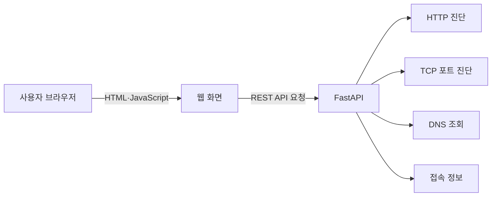

# 네트워크 진단 웹서비스 기능 명세서

## 1. 문서 개요

| 항목 | 내용 |
|---|---|
| 프로젝트명 | Network Diagnostic Tool |
| 목적 | 웹에서 HTTP, TCP 포트, DNS 및 접속 정보를 간단히 점검하는 네트워크 진단 서비스 구축 |
| 백엔드 | Python 3.12, FastAPI, Uvicorn |
| 프론트엔드 | HTML5, CSS3, Vanilla JavaScript |
| 1차 구현 범위 | HTTP 상태 확인, TCP 포트 확인, DNS 조회, 내 접속 정보 확인 |
| 주요 사용자 | 네트워크·서버 구성 및 장애 상황을 점검하려는 운영자·학습자 |

## 2. 서비스 목표

- 사용자가 브라우저에서 진단 대상 URL, 호스트, 포트를 입력할 수 있다.
- FastAPI 서버가 대상 시스템에 실제 진단 요청을 수행한다.
- 성공 여부뿐 아니라 응답시간, 상태 코드, IP 주소 등 판단에 필요한 정보를 제공한다.
- 입력 오류, 타임아웃, DNS 실패, 연결 거부를 구분하여 표시한다.
- 사설망 스캔 및 SSRF 악용을 방지할 수 있는 입력 검증과 접근 제한을 적용한다.

## 3. 전체 구조



## 4. 공통 정책

### 4.1 공통 응답 형식

모든 API는 아래 구조를 기본으로 사용한다.

```json
{
  "success": true,
  "data": {},
  "error": null,
  "meta": {
    "request_id": "4fdd44ef-3bc7-4b37-9e3b-baf5685f1814",
    "timestamp": "2026-08-05T13:00:00+09:00",
    "duration_ms": 35
  }
}
```

오류 발생 시의 예시는 다음과 같다.

```json
{
  "success": false,
  "data": null,
  "error": {
    "code": "CONNECTION_TIMEOUT",
    "message": "대상 서버가 제한 시간 내에 응답하지 않았습니다."
  },
  "meta": {
    "request_id": "c5698ea0-44ee-4db2-a093-629231903f6a",
    "timestamp": "2026-08-05T13:00:00+09:00",
    "duration_ms": 3001
  }
}
```

### 4.2 공통 오류 코드

| 오류 코드 | HTTP 상태 | 의미 |
|---|---:|---|
| `VALIDATION_ERROR` | 422 | URL, 호스트 또는 포트 형식 오류 |
| `TARGET_NOT_ALLOWED` | 403 | 허용되지 않은 대상 주소 |
| `DNS_RESOLUTION_FAILED` | 400 | 도메인을 IP로 변환하지 못함 |
| `CONNECTION_REFUSED` | 200 | 대상까지 도달했으나 포트 연결이 거부됨 |
| `CONNECTION_TIMEOUT` | 200 | 제한 시간 내 응답 없음 |
| `TLS_ERROR` | 200 | HTTPS 인증서 또는 TLS 연결 실패 |
| `RATE_LIMIT_EXCEEDED` | 429 | 호출 횟수 제한 초과 |
| `INTERNAL_SERVER_ERROR` | 500 | 서버 내부 오류 |

진단 결과의 실패는 정상적으로 완료된 진단 결과이므로 `200`으로 반환하고, API 자체의 요청 오류와 서버 오류만 `4xx`, `5xx`로 구분한다.

## 5. 백엔드 기능 명세

### BE-01. HTTP/HTTPS 상태 확인

| 항목 | 내용 |
|---|---|
| API | `POST /api/v1/http-check` |
| 목적 | 지정한 URL의 접속 여부와 HTTP 응답 상태 확인 |
| 입력 | URL, 요청 방식, 타임아웃, 리다이렉트 추적 여부 |
| 처리 방식 | `httpx.AsyncClient`로 비동기 요청 수행 |
| 기본 타임아웃 | 5초 |

요청 예시:

```json
{
  "url": "https://example.com",
  "method": "GET",
  "timeout_seconds": 5,
  "follow_redirects": true
}
```

응답 데이터:

| 필드 | 형식 | 설명 |
|---|---|---|
| `url` | string | 사용자가 입력한 URL |
| `final_url` | string | 리다이렉트 완료 후 최종 URL |
| `reachable` | boolean | HTTP 연결 및 응답 수신 여부 |
| `status_code` | integer/null | HTTP 상태 코드 |
| `reason_phrase` | string/null | 상태 코드 설명 |
| `resolved_ip` | string/null | 실제 연결 대상 IP |
| `response_time_ms` | integer | 요청부터 응답 헤더 수신까지의 시간 |
| `content_length` | integer/null | 응답 크기 또는 Content-Length |
| `content_type` | string/null | 응답 콘텐츠 유형 |
| `server` | string/null | Server 응답 헤더 |
| `redirect_count` | integer | 리다이렉트 횟수 |

처리 조건:

- `http`, `https` 스킴만 허용한다.
- 사용자 입력 URL에 인증정보(`user:password@host`)가 포함되면 거부한다.
- 응답 본문 전체를 저장하지 않고 최대 수신 크기를 제한한다.
- 리다이렉트 단계마다 목적지 IP를 재검증한다.
- `2xx`, `3xx`, `4xx`, `5xx`는 모두 정상적인 HTTP 응답 결과로 표시한다.

### BE-02. TCP 포트 연결 확인

| 항목 | 내용 |
|---|---|
| API | `POST /api/v1/port-check` |
| 목적 | 특정 호스트의 TCP 포트 연결 가능 여부 확인 |
| 입력 | 호스트, 포트, 타임아웃 |
| 처리 방식 | `asyncio.open_connection()` 사용 |
| 기본 타임아웃 | 3초 |

요청 예시:

```json
{
  "host": "example.com",
  "port": 443,
  "timeout_seconds": 3
}
```

응답 데이터:

| 필드 | 형식 | 설명 |
|---|---|---|
| `host` | string | 입력 호스트 |
| `resolved_ips` | array | DNS 조회로 확인된 IP 목록 |
| `port` | integer | 대상 TCP 포트 |
| `open` | boolean | TCP 연결 성공 여부 |
| `result` | string | `OPEN`, `REFUSED`, `TIMEOUT`, `DNS_FAILED`, `BLOCKED` |
| `connection_time_ms` | integer/null | TCP 연결 완료 시간 |
| `message` | string | 사용자 표시용 결과 설명 |

처리 조건:

- 포트 범위는 `1~65535`로 제한한다.
- 한 요청에서 하나의 포트만 진단한다.
- 연결 성공 후 소켓을 즉시 정상 종료한다.
- 공개 서비스에서는 허용 포트 목록을 적용한다. 예: `22, 53, 80, 443, 5432, 3306, 6379, 8080`.

### BE-03. DNS 조회

| 항목 | 내용 |
|---|---|
| API | `POST /api/v1/dns-lookup` |
| 목적 | 도메인의 DNS 레코드와 해석 시간 확인 |
| 입력 | 도메인, 레코드 유형 |
| 지원 유형 | `A`, `AAAA`, `CNAME`, `MX`, `TXT`, `NS` |
| 처리 방식 | `dnspython` 비동기 리졸버 사용 |

요청 예시:

```json
{
  "domain": "example.com",
  "record_type": "A"
}
```

응답 데이터:

| 필드 | 형식 | 설명 |
|---|---|---|
| `domain` | string | 조회 도메인 |
| `record_type` | string | 조회 레코드 유형 |
| `records` | array | 레코드 값 목록 |
| `ttl` | integer/null | DNS 캐시 유지 시간 |
| `resolver` | string/null | 사용한 DNS 리졸버 |
| `lookup_time_ms` | integer | 조회 소요 시간 |

처리 조건:

- `http://`, 경로, 포트가 포함되지 않은 순수 도메인만 허용한다.
- 레코드가 없는 경우와 도메인 자체가 없는 경우를 구분한다.
- 국제화 도메인은 IDNA 형식으로 변환하여 조회한다.

### BE-04. 내 접속 정보 확인

| 항목 | 내용 |
|---|---|
| API | `GET /api/v1/client-info` |
| 목적 | FastAPI 서버가 수신한 클라이언트 요청 정보 표시 |
| 입력 | 없음 |

응답 데이터:

| 필드 | 형식 | 설명 |
|---|---|---|
| `client_ip` | string | 서버가 확인한 접속 IP |
| `forwarded_for` | array | 신뢰할 수 있는 프록시가 전달한 IP 목록 |
| `user_agent` | string/null | 브라우저 User-Agent |
| `accept_language` | string/null | 브라우저 언어 설정 |
| `protocol` | string | HTTP 프로토콜 버전 |
| `scheme` | string | `http` 또는 `https` |
| `host` | string | 요청 Host 헤더 |

처리 조건:

- `X-Forwarded-For`는 신뢰 프록시를 통해 들어온 요청일 때만 실제 IP 판정에 사용한다.
- `Cookie`, `Authorization` 등 민감한 요청 헤더는 응답하지 않는다.

### BE-05. 헬스 체크

| 항목 | 내용 |
|---|---|
| API | `GET /health` |
| 목적 | 애플리케이션 실행 상태 확인 |
| 응답 | `{"status":"ok"}` |
| 사용처 | 로드밸런서, Docker, 모니터링 시스템 |

### BE-06. 요청 기록 및 로깅

- 요청 ID, API 경로, 처리 결과, 처리시간, 클라이언트 IP를 기록한다.
- 사용자가 입력한 URL과 호스트는 기록할 수 있지만 쿼리 문자열의 민감정보는 마스킹한다.
- 비밀번호, Authorization, Cookie는 기록하지 않는다.
- 로그 레벨은 `INFO`, 입력 검증 실패는 `WARNING`, 시스템 예외는 `ERROR`로 구분한다.

## 6. 프론트엔드 기능 명세

### FE-01. 화면 구성

단일 페이지에서 탭 또는 카드 형태로 네 가지 진단 기능을 제공한다.

| 영역 | 구성 요소 |
|---|---|
| 헤더 | 서비스명, 간단한 사용 안내 |
| 진단 메뉴 | HTTP 확인, 포트 확인, DNS 조회, 접속 정보 탭 |
| 입력 영역 | 기능별 입력창, 선택 옵션, 실행 버튼 |
| 결과 영역 | 성공·실패 상태, 핵심 결과, 상세 데이터 |
| 공통 상태 | 요청 진행 중, 입력 오류, API 오류 표시 |

### FE-02. HTTP 상태 확인 화면

| 요소 | 형식 | 기본값/조건 |
|---|---|---|
| URL | text | 필수, `https://example.com` 형식 |
| 요청 방식 | select | `GET`, `HEAD`; 기본 `GET` |
| 타임아웃 | number | 1~10초, 기본 5초 |
| 리다이렉트 추적 | checkbox | 기본 선택 |
| 확인 버튼 | button | 유효한 입력일 때 실행 |

결과 표시:

- 연결 성공 여부
- HTTP 상태 코드와 설명
- 최종 URL 및 대상 IP
- 응답시간, 콘텐츠 유형, 응답 크기
- 리다이렉트 횟수

상태 색상은 `2xx=성공`, `3xx=정보`, `4xx·5xx=주의`, 연결 실패=`오류`로 구분하되 색상만으로 의미를 전달하지 않고 텍스트를 함께 표시한다.

### FE-03. 포트 확인 화면

| 요소 | 형식 | 기본값/조건 |
|---|---|---|
| 호스트 | text | 필수, 도메인 또는 IP |
| 포트 | number | 필수, 1~65535 |
| 빠른 선택 | buttons | 22, 53, 80, 443, 3306, 5432, 6379, 8080 |
| 타임아웃 | number | 1~10초, 기본 3초 |
| 확인 버튼 | button | 유효한 입력일 때 실행 |

결과 표시:

- 포트 열림 또는 닫힘
- 연결 거부와 타임아웃 구분
- 변환된 IP 주소
- TCP 연결 소요 시간

### FE-04. DNS 조회 화면

| 요소 | 형식 | 기본값/조건 |
|---|---|---|
| 도메인 | text | 필수, 순수 도메인 입력 |
| 레코드 유형 | select | 기본 `A` |
| 조회 버튼 | button | 유효한 입력일 때 실행 |

결과는 레코드 값, TTL, 조회시간을 표 형식으로 표시한다. 결과가 여러 개인 경우 행을 나누어 출력한다.

### FE-05. 접속 정보 화면

- 탭 진입 시 `GET /api/v1/client-info`를 호출한다.
- 접속 IP, 프록시 전달 IP, User-Agent, 언어, 프로토콜, 접속 방식과 Host를 표로 표시한다.
- 다시 조회 버튼을 제공한다.

### FE-06. 공통 사용자 경험

- API 호출 중 실행 버튼을 비활성화하고 로딩 상태를 표시한다.
- 완료 후 결과 영역으로 초점을 이동하거나 결과 영역에 `aria-live`를 적용한다.
- 입력값이 잘못된 경우 API 호출 전에 필드 하단에 원인을 표시한다.
- 서버 오류 메시지는 기술 예외 원문 대신 사용자가 이해할 수 있는 문장으로 표시한다.
- 최근 조회 결과는 5건까지 브라우저 메모리 또는 `localStorage`에 선택적으로 저장한다.
- 동일 버튼을 연속 클릭해 중복 요청이 발생하지 않도록 한다.

## 7. 프론트엔드와 백엔드 연동 규칙

| 항목 | 기준 |
|---|---|
| API 기본 경로 | `/api/v1` |
| 데이터 형식 | `application/json` |
| 호출 방식 | JavaScript `fetch()` |
| 문자 인코딩 | UTF-8 |
| 시간 표시 | 서버는 ISO 8601, 화면은 사용자 로컬 시간 |
| 시간 단위 | 밀리초(ms) |
| 요청 취소 | `AbortController`를 사용하여 화면 타임아웃 또는 재요청 시 취소 |
| 동일 출처 배포 | FastAPI가 정적 파일을 함께 제공하면 CORS 설정 불필요 |
| 분리 배포 | 허용할 프론트엔드 Origin만 CORS 목록에 등록 |

## 8. 입력 검증 기준

| 입력 | 검증 기준 |
|---|---|
| URL | 최대 2,048자, `http/https`만 허용, 인증정보 금지 |
| 호스트 | 최대 253자, 유효한 IPv4·IPv6 또는 도메인 |
| 도메인 | 각 라벨 63자 이하, 전체 253자 이하 |
| 포트 | 정수, 1~65535 |
| 타임아웃 | 1~10초 |
| DNS 유형 | 서버에서 정의한 허용 목록만 사용 |

프론트엔드 검증은 사용 편의를 위한 것이며, 백엔드에서 동일한 기준으로 반드시 재검증한다.

## 9. 보안 요구사항

네트워크 진단 서비스는 서버가 사용자가 지정한 주소로 접속하는 구조이므로 SSRF와 포트 스캔 방지가 필수다.

- 운영 정책에 따라 허용 도메인 또는 허용 IP 대역을 설정한다.
- 외부 공개 서비스에서는 루프백, 링크 로컬, 멀티캐스트, 메타데이터 주소 및 사설 IP 접근을 차단한다.
- 사내 진단 서비스에서 사설 IP가 필요하다면 인증된 사용자에게만 제한적으로 허용한다.
- DNS 조회 후 반환된 모든 IP를 검사하며, 연결 직전에도 실제 대상 IP를 확인한다.
- HTTP 리다이렉트 대상도 단계마다 다시 검증한다.
- 사용자별·IP별 요청 횟수를 제한한다. 예: 분당 30회.
- TCP 포트는 허용 목록을 적용하거나 관리자 설정으로 범위를 제한한다.
- 응답 본문 크기와 리다이렉트 횟수를 제한한다.
- API 예외 내용과 서버 내부 경로를 사용자에게 노출하지 않는다.
- 운영 환경에서는 HTTPS를 사용한다.

## 10. 비기능 요구사항

| 구분 | 요구사항 |
|---|---|
| 성능 | 일반 진단 API 자체 처리 오버헤드는 100ms 이하를 목표로 하며 외부 대기시간은 별도 표시 |
| 동시성 | 네트워크 I/O는 비동기로 처리하고 동시 진단 수를 세마포어로 제한 |
| 가용성 | `/health`를 통해 서비스 상태 확인 가능 |
| 호환성 | 최신 Chrome, Edge, Firefox 지원 |
| 반응형 | 360px 이상 모바일 및 데스크톱 화면 지원 |
| 접근성 | 키보드 조작, 명확한 레이블, 결과 영역 스크린리더 알림 지원 |
| 유지보수 | 라우터, 서비스, 스키마, 보안 검증 모듈 분리 |
| 테스트 | API 단위 테스트와 정상·실패·타임아웃 시나리오 포함 |

## 11. 권장 프로젝트 구조

```text
network-diagnostic-tool/
├── app/
│   ├── main.py
│   ├── api/
│   │   ├── http_check.py
│   │   ├── port_check.py
│   │   ├── dns_lookup.py
│   │   └── client_info.py
│   ├── schemas/
│   │   ├── request.py
│   │   └── response.py
│   ├── services/
│   │   ├── http_service.py
│   │   ├── tcp_service.py
│   │   └── dns_service.py
│   ├── core/
│   │   ├── config.py
│   │   ├── security.py
│   │   └── logging.py
│   └── static/
│       ├── index.html
│       ├── css/style.css
│       └── js/app.js
├── tests/
├── requirements.txt
├── .env.example
└── README.md
```

## 12. 주요 테스트 시나리오

| ID | 기능 | 테스트 내용 | 예상 결과 |
|---|---|---|---|
| TC-01 | HTTP | 정상 HTTPS URL 입력 | 상태 코드와 응답시간 표시 |
| TC-02 | HTTP | 존재하지 않는 도메인 입력 | DNS 실패 메시지 표시 |
| TC-03 | HTTP | 응답이 느린 URL 입력 | 타임아웃 결과 표시 |
| TC-04 | HTTP | 리다이렉트 URL 입력 | 최종 URL과 횟수 표시 |
| TC-05 | 포트 | 접근 가능한 443 포트 확인 | `OPEN` 표시 |
| TC-06 | 포트 | 연결 거부 포트 확인 | `REFUSED` 표시 |
| TC-07 | 포트 | 응답 없는 대상 확인 | `TIMEOUT` 표시 |
| TC-08 | DNS | A 레코드 조회 | IPv4 목록과 TTL 표시 |
| TC-09 | DNS | 존재하지 않는 도메인 조회 | 도메인 없음 메시지 표시 |
| TC-10 | 접속 정보 | 프록시 없이 접속 | 직접 접속 IP 표시 |
| TC-11 | 보안 | 루프백 또는 메타데이터 주소 요청 | `TARGET_NOT_ALLOWED` 반환 |
| TC-12 | 제한 | 짧은 시간에 반복 요청 | `429` 반환 |

## 13. 개발 우선순위

### 1단계: 필수 MVP

1. FastAPI 기본 구성 및 정적 페이지 제공
2. HTTP 상태 확인 API와 화면
3. TCP 포트 확인 API와 화면
4. DNS 조회 API와 화면
5. 접속 정보 API와 화면
6. 공통 오류 처리, 입력 검증, 로딩·결과 UI
7. SSRF 방지와 요청 횟수 제한

### 2단계: 개선 기능

1. 진단 이력 저장 및 CSV 다운로드
2. SSL 인증서 정보 조회
3. WebSocket 연결 테스트
4. 로드밸런서 응답 서버 식별
5. 반복 진단 및 응답시간 변화 그래프

## 14. 완료 기준

- 네 가지 진단 기능이 단일 웹페이지에서 정상 작동한다.
- 정상, 연결 거부, DNS 실패, 타임아웃 결과가 서로 구분된다.
- 잘못된 입력은 명확한 안내와 함께 차단된다.
- 허용되지 않은 내부 주소와 포트에 대한 접근이 제한된다.
- API 자동 문서(`/docs`)에서 요청과 응답을 확인할 수 있다.
- 주요 정상·실패 시나리오의 자동 테스트가 통과한다.
- 데스크톱과 모바일 환경에서 입력 및 결과 확인이 가능하다.
